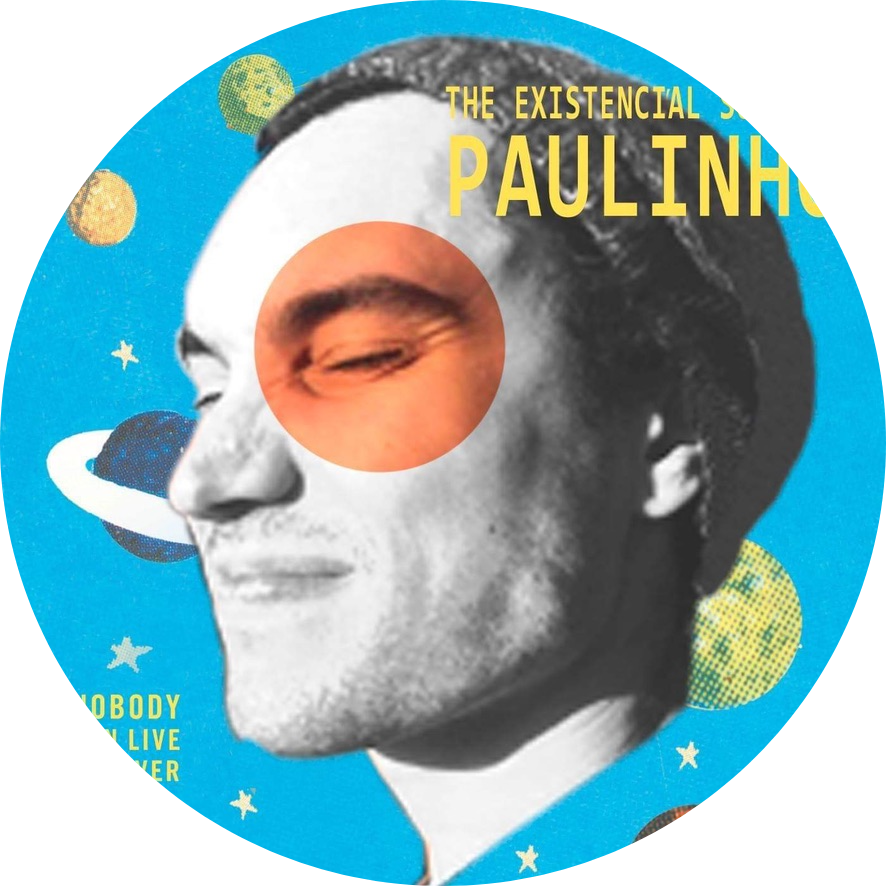

<h2> Hi, I'm Paulo Campedelli! </h2>

<><br>Software Enginner studying at <a href="https://www.algonquincollege.com/">Algonquin College</a></br>
Proud Program Assistant, supporting and inspiring students at <a href="https://www.algonquincollege.com/">Algonquin College</a></em></p>


[](https://twitter.com/littlepaulart)
[](https://www.linkedin.com/in/paulo-campedelli-25117287/)

### A little more about me...

```javascript
const paulo = {
  code: [Javascript, Typescript, HTML, CSS, Ruby, Python, Swift, Kotlin, C++, Dart],
  tools: [React, Redux, Node, NextJS, Astro, Flutter, Selenium, Cucumber, MongoDB, SQLite, ThreeJS, GSap],
  techCommunities: {
    tutor: "Algonquin College",
    member: "Brito - Brazilian IT Ottawa",
    founder: "KbritoCS - APIs for Counter Strike"
  },
  challenge:
    "#100DaysOfSillyCoding - a challenge I created for developers to have fun while coding :)",
};
```

 <em>I love building innovative projects and connecting with like-minded people who share a passion for creating a more inclusive and engaging web.<b> Let's build together</b> :)</em>

---
